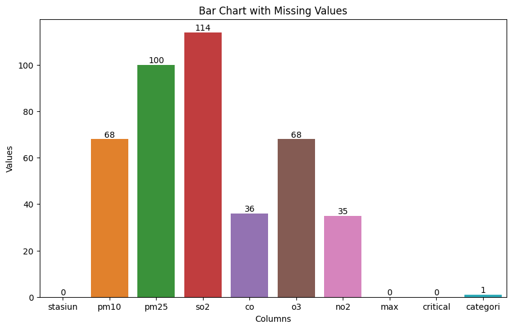
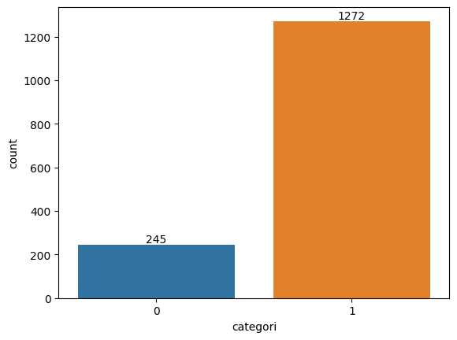
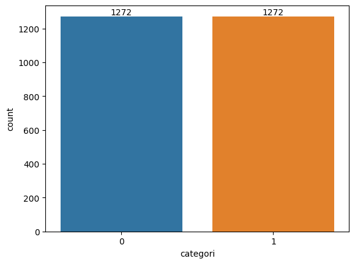
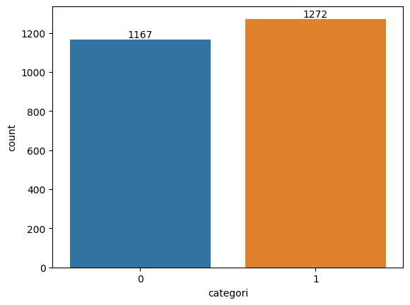
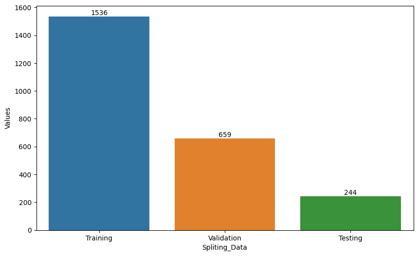
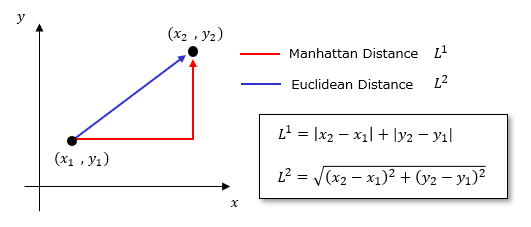
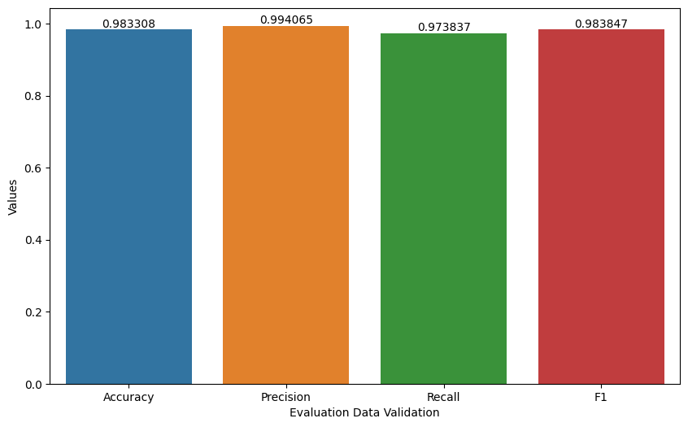
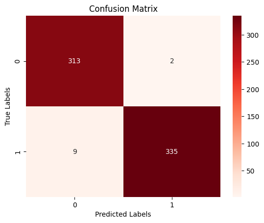
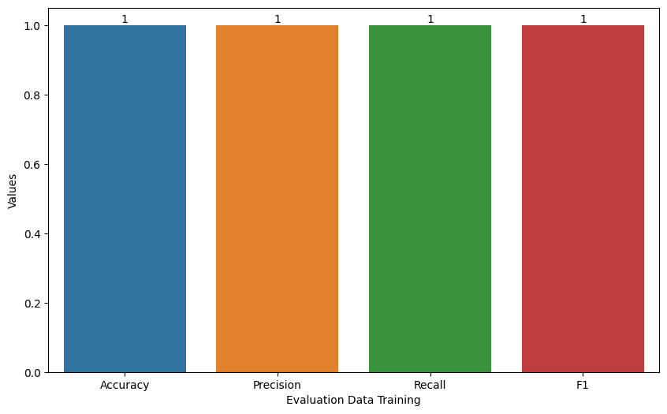

---
jupyter:
  kernelspec:
    display_name: Python 3 (ipykernel)
    language: python
    name: python3
  language_info:
    codemirror_mode:
      name: ipython
      version: 3
    file_extension: .py
    mimetype: text/x-python
    name: python
    nbconvert_exporter: python
    pygments_lexer: ipython3
    version: 3.8.16
  nbformat: 4
  nbformat_minor: 4
---

::: {.cell .markdown}
# Esay Report Intro to Machine Learning Project

-   Nama = Riyan Zaenal Arifin
-   Email = <riyanzaenal411@gmail.com>
:::

::: {.cell .markdown}
## Intoduction
:::

::: {.cell .markdown}
Pecemaran udara meupakan hal yang lumrah di kota besar seperti di
Jakarta untuk saat ini. Polusi udara di Jakarta disebabkan karena
banyaknya penduduk yang masih mengandalkan transportasi berbahan bakar
fosil dalam berpergian. Selain itu, polusi udara juga disebabkan oleh
pabrik-pabrik di sekitar Jakarta, sehingga polusi udara di Jakarta
semakin parah. Bahkan Jakarta masuk dalam kota yang memilki tingkat
polusi udara paling tinggi di dunia. Sehingga penulis termotivasi untuk
membantu untuk memprediksi kondisi udara melalui beberapa kriteria
menggunakan model machine leraning, lalu model machine learning dapat
memprediksi kondisi udara, apakah baik atau tidak baik. Untuk model
machine learning yang digunakan adalah KNN. Sebelum pemodelan machine
learning juga dilakukan proses preprocessing, feature engineering, label
encoder, balancing data menggunakan over sampling, dan lain-lain,
sehingga bisa diperoleh model yang optimal. Dengan begitu, model machine
learning tersebut bisa diaplikasikan untuk memudahkan dalam mengetahui
kondisi udara di jakarta, sehingga dapat diperoleh untuk pengambilan
keputusan yang lebih lanjut dari pihak pemerintah dalam menangani polusi
udara di Jakarta.
:::

::: {.cell .markdown}
## Related Work

-   <https://journal.universitasmulia.ac.id/index.php/metik/article/view/343>

    Data relatif sangat sedikit, yakni hanya 25 saja. Tidak dijelaskan
    dalam proses preprocessing data. Selain itu tidak dijelaskan
    features nya apa saja dan pemabgian data training dan validationnya.
    Tahap deployment menggunakan framework django sudah sesuai.

-   <https://jurnal-backup.kaputama.ac.id/index.php/JTIK/article/view/790>

    Tidak dijelaskan jumlah, features dan sumber datanya. Menggunakan
    cross validation, tetapi akurasi tidak dirata-ratakan dari berapa
    kali percobaan K-Fold, hanya diambil nilai akurasi tertinggi. Tidak
    diketahui akurasi data training, sehingga tidak bisa dipastikan
    apakah model overfiting atau tidak.

-   <https://www.jurnal.yoctobrain.org/index.php/ijodas/article/view/11>

    Tidak dijelaskan features dan sumber datanya. Tidak dijelaskan tahap
    preprocessingnya. Jumlah data terlalu sedikit dan hasil evaluasi
    kurang bagus menandakan model underfiting. Selain itu juga
    dijelaskan pemahaman mengenai evaluasi model

-   <https://ejournal.bsi.ac.id/ejurnal/index.php/evolusi/article/view/12514/5403>

    Tidak diketahui pasti terkait sumber datanya. Penjelasan terkait
    perhitungan jarak tetangga KNN hanya euclidean distance saja.
    Selebihnya juga sudah bagus. Terdapat perbadningan evaluasi data
    training dan data validation

-   <https://jurnal.umk.ac.id/index.php/simet/article/view/2882>

    Jumlah data relatif banyak, sampai puluhan ribu. Hampir keseluruhan
    sudah baik. Menggunakan cross validation, tetapi tidak diketahu
    hasil evaluasi data validation, sehingga tidak diketahui apakah
    model mengalami overfiting atau tidak.
:::

::: {.cell .markdown}
## Dataset and Features
:::

::: {.cell .markdown}
Dataset yang digunakan berisi mengenai Indeks Standar Pencemar Udara
(ISPU) yang diukur dari 5 stasiun pemantau kualitas udara (SPKU) yang
ada di Provinsi DKI Jakarta Tahun 2021 Penjelasan features dari dataset
sebagai berikut :

-   tanggal : Tanggal pengukuran kualitas udara
-   pm10 : Partikulat salah satu parameter yang diukur
-   pm25 : Partikulat salah satu parameter yang diukur
-   so2 : Sulfida (dalam bentuk SO2) salah satu parameter yang diukur
-   co : Carbon Monoksida salah satu parameter yand diukur
-   o3 : Ozon salah satu parameter yang diukur
-   no2 : NItrogen dioksida salah satu parameter yang diukur
-   max : Nilai ukur paling tinggi dari seluruh parameter yang diukur
    dalam waktu yang sama
-   critical : Parameter yang hasil pengukurannya paling tinggi
-   categori : Kategori hasil perhitungan indeks standar pencemaran
    udara
-   location : Kode lokasi

Data Source :
<https://data.jakarta.go.id/dataset/indeks-standar-pencemaran-udara-ispu-tahun-2021>

Berikut langkah-langkah dalam prerpocessing data :
:::

::: {.cell .code execution_count="309"}
``` python
import pandas as pd 
import numpy as np
from sklearn.metrics import confusion_matrix
from sklearn import preprocessing
from sklearn.neighbors import KNeighborsClassifier
from sklearn.metrics import accuracy_score, precision_score, recall_score, f1_score
import matplotlib.pyplot as plt
import seaborn as sns
from sklearn.metrics import classification_report
from sklearn.model_selection import train_test_split
from imblearn.over_sampling import SMOTE
%matplotlib inline
```
:::

::: {.cell .code execution_count="308"}
``` python
#import dataset
df_jan = pd.read_csv('/home/riyan/IntroML/Dataset/indeks-standar-pencemar-udara-di-spku-bulan-januari-tahun-2021.csv')
df_feb = pd.read_csv('/home/riyan/IntroML/Dataset/indeks-standar-pencemar-udara-di-spku-bulan-februari-tahun-2021.csv')
df_mar = pd.read_csv('/home/riyan/IntroML/Dataset/indeks-standar-pencemar-udara-di-spku-bulan-maret-tahun-2021.csv')
df_apr = pd.read_csv('/home/riyan/IntroML/Dataset/indeks-standar-pencemar-udara-di-spku-bulan-april-tahun-2021.csv')
df_mei = pd.read_csv('/home/riyan/IntroML/Dataset/indeks-standar-pencemar-udara-di-spku-bulan-mei-tahun-2021.csv')
df_juni = pd.read_csv('/home/riyan/IntroML/Dataset/indeks-standar-pencemar-udara-di-spku-bulan-juni-tahun-2021.csv')
df_juli = pd.read_csv('/home/riyan/IntroML/Dataset/indeks-standar-pencemar-udara-di-spku-bulan-juli-tahun-2021.csv')
df_agust = pd.read_csv('/home/riyan/IntroML/Dataset/indeks-standar-pencemar-udara-di-spku-bulan-agustus-tahun-2021.csv')
df_sept = pd.read_csv('/home/riyan/IntroML/Dataset/indeks-standar-pencemar-udara-di-spku-bulan-september-tahun-2021.csv')
df_okto = pd.read_csv('/home/riyan/IntroML/Dataset/indeks-standar-pencemar-udara-di-spku-bulan-oktober-tahun-2021.csv')
df_nov = pd.read_csv('/home/riyan/IntroML/Dataset/indeks-standar-pencemar-udara-di-spku-bulan-november-tahun-2021.csv')
df_desm  = pd.read_csv('/home/riyan/IntroML/Dataset/indeks-standar-pencemar-udara-di-spku-bulan-desember-tahun-2021.csv')

#integrate column name juni and juli
df_juni.columns = df_desm.columns
df_juli.columns = df_desm.columns

#concate dataset
dataset = pd.concat([df_jan, df_feb, df_mar, df_apr, df_mei,df_juni,df_juli,df_agust,df_sept,df_okto,df_nov,df_desm])
dataset

```

::: {.output .execute_result execution_count="308"}
```{=html}
<div>
<style scoped>
    .dataframe tbody tr th:only-of-type {
        vertical-align: middle;
    }

    .dataframe tbody tr th {
        vertical-align: top;
    }

    .dataframe thead th {
        text-align: right;
    }
</style>
<table border="1" class="dataframe">
  <thead>
    <tr style="text-align: right;">
      <th></th>
      <th>tanggal</th>
      <th>stasiun</th>
      <th>pm10</th>
      <th>pm25</th>
      <th>so2</th>
      <th>co</th>
      <th>o3</th>
      <th>no2</th>
      <th>max</th>
      <th>critical</th>
      <th>categori</th>
    </tr>
  </thead>
  <tbody>
    <tr>
      <th>0</th>
      <td>2021-01-01</td>
      <td>DKI1 (Bunderan HI)</td>
      <td>38</td>
      <td>53</td>
      <td>29</td>
      <td>6</td>
      <td>31</td>
      <td>13</td>
      <td>53</td>
      <td>PM25</td>
      <td>SEDANG</td>
    </tr>
    <tr>
      <th>1</th>
      <td>2021-01-02</td>
      <td>DKI1 (Bunderan HI)</td>
      <td>27</td>
      <td>46</td>
      <td>27</td>
      <td>7</td>
      <td>47</td>
      <td>7</td>
      <td>47</td>
      <td>O3</td>
      <td>BAIK</td>
    </tr>
    <tr>
      <th>2</th>
      <td>2021-01-03</td>
      <td>DKI1 (Bunderan HI)</td>
      <td>44</td>
      <td>58</td>
      <td>25</td>
      <td>7</td>
      <td>40</td>
      <td>13</td>
      <td>58</td>
      <td>PM25</td>
      <td>SEDANG</td>
    </tr>
    <tr>
      <th>3</th>
      <td>2021-01-04</td>
      <td>DKI1 (Bunderan HI)</td>
      <td>30</td>
      <td>48</td>
      <td>24</td>
      <td>4</td>
      <td>32</td>
      <td>7</td>
      <td>48</td>
      <td>PM25</td>
      <td>BAIK</td>
    </tr>
    <tr>
      <th>4</th>
      <td>2021-01-05</td>
      <td>DKI1 (Bunderan HI)</td>
      <td>38</td>
      <td>53</td>
      <td>24</td>
      <td>6</td>
      <td>31</td>
      <td>9</td>
      <td>53</td>
      <td>PM25</td>
      <td>SEDANG</td>
    </tr>
    <tr>
      <th>...</th>
      <td>...</td>
      <td>...</td>
      <td>...</td>
      <td>...</td>
      <td>...</td>
      <td>...</td>
      <td>...</td>
      <td>...</td>
      <td>...</td>
      <td>...</td>
      <td>...</td>
    </tr>
    <tr>
      <th>150</th>
      <td>2021-12-27</td>
      <td>DKI5 (Kebon Jeruk) Jakarta Barat</td>
      <td>54</td>
      <td>76</td>
      <td>36</td>
      <td>14</td>
      <td>21</td>
      <td>47</td>
      <td>76</td>
      <td>PM25</td>
      <td>SEDANG</td>
    </tr>
    <tr>
      <th>151</th>
      <td>2021-12-28</td>
      <td>DKI5 (Kebon Jeruk) Jakarta Barat</td>
      <td>44</td>
      <td>68</td>
      <td>20</td>
      <td>11</td>
      <td>21</td>
      <td>33</td>
      <td>68</td>
      <td>PM25</td>
      <td>SEDANG</td>
    </tr>
    <tr>
      <th>152</th>
      <td>2021-12-29</td>
      <td>DKI5 (Kebon Jeruk) Jakarta Barat</td>
      <td>34</td>
      <td>54</td>
      <td>28</td>
      <td>8</td>
      <td>25</td>
      <td>29</td>
      <td>54</td>
      <td>PM25</td>
      <td>SEDANG</td>
    </tr>
    <tr>
      <th>153</th>
      <td>2021-12-30</td>
      <td>DKI5 (Kebon Jeruk) Jakarta Barat</td>
      <td>53</td>
      <td>75</td>
      <td>25</td>
      <td>15</td>
      <td>23</td>
      <td>44</td>
      <td>75</td>
      <td>PM25</td>
      <td>SEDANG</td>
    </tr>
    <tr>
      <th>154</th>
      <td>2021-12-31</td>
      <td>DKI5 (Kebon Jeruk) Jakarta Barat</td>
      <td>60</td>
      <td>87</td>
      <td>28</td>
      <td>19</td>
      <td>30</td>
      <td>53</td>
      <td>87</td>
      <td>PM25</td>
      <td>SEDANG</td>
    </tr>
  </tbody>
</table>
<p>1825 rows × 11 columns</p>
</div>
```
:::
:::

::: {.cell .markdown}
### Preprocessing data
:::

::: {.cell .markdown}
#### Normalisasi data
:::

::: {.cell .code execution_count="310"}
``` python
dataset['categori'].value_counts()
```

::: {.output .execute_result execution_count="310"}
    categori
    SEDANG            1349
    TIDAK SEHAT        272
    BAIK               187
    TIDAK ADA DATA      16
    Name: count, dtype: int64
:::
:::

::: {.cell .code execution_count="311"}
``` python
#rename value SEDANG to BAIK in column categori
dataset['categori'] = dataset['categori'].replace(['SEDANG'], 'BAIK')
dataset['categori'].value_counts()
```

::: {.output .execute_result execution_count="311"}
    categori
    BAIK              1536
    TIDAK SEHAT        272
    TIDAK ADA DATA      16
    Name: count, dtype: int64
:::
:::

::: {.cell .markdown}
#### Feature Enginnering
:::

::: {.cell .markdown}
Data tanggal tidak digunakan dalam kasus klasifikasi, sehingga bisa
dihapus
:::

::: {.cell .code execution_count="312"}
``` python
dataset = dataset.drop(['tanggal'], axis=1)
dataset
```

::: {.output .execute_result execution_count="312"}
```{=html}
<div>
<style scoped>
    .dataframe tbody tr th:only-of-type {
        vertical-align: middle;
    }

    .dataframe tbody tr th {
        vertical-align: top;
    }

    .dataframe thead th {
        text-align: right;
    }
</style>
<table border="1" class="dataframe">
  <thead>
    <tr style="text-align: right;">
      <th></th>
      <th>stasiun</th>
      <th>pm10</th>
      <th>pm25</th>
      <th>so2</th>
      <th>co</th>
      <th>o3</th>
      <th>no2</th>
      <th>max</th>
      <th>critical</th>
      <th>categori</th>
    </tr>
  </thead>
  <tbody>
    <tr>
      <th>0</th>
      <td>DKI1 (Bunderan HI)</td>
      <td>38</td>
      <td>53</td>
      <td>29</td>
      <td>6</td>
      <td>31</td>
      <td>13</td>
      <td>53</td>
      <td>PM25</td>
      <td>BAIK</td>
    </tr>
    <tr>
      <th>1</th>
      <td>DKI1 (Bunderan HI)</td>
      <td>27</td>
      <td>46</td>
      <td>27</td>
      <td>7</td>
      <td>47</td>
      <td>7</td>
      <td>47</td>
      <td>O3</td>
      <td>BAIK</td>
    </tr>
    <tr>
      <th>2</th>
      <td>DKI1 (Bunderan HI)</td>
      <td>44</td>
      <td>58</td>
      <td>25</td>
      <td>7</td>
      <td>40</td>
      <td>13</td>
      <td>58</td>
      <td>PM25</td>
      <td>BAIK</td>
    </tr>
    <tr>
      <th>3</th>
      <td>DKI1 (Bunderan HI)</td>
      <td>30</td>
      <td>48</td>
      <td>24</td>
      <td>4</td>
      <td>32</td>
      <td>7</td>
      <td>48</td>
      <td>PM25</td>
      <td>BAIK</td>
    </tr>
    <tr>
      <th>4</th>
      <td>DKI1 (Bunderan HI)</td>
      <td>38</td>
      <td>53</td>
      <td>24</td>
      <td>6</td>
      <td>31</td>
      <td>9</td>
      <td>53</td>
      <td>PM25</td>
      <td>BAIK</td>
    </tr>
    <tr>
      <th>...</th>
      <td>...</td>
      <td>...</td>
      <td>...</td>
      <td>...</td>
      <td>...</td>
      <td>...</td>
      <td>...</td>
      <td>...</td>
      <td>...</td>
      <td>...</td>
    </tr>
    <tr>
      <th>150</th>
      <td>DKI5 (Kebon Jeruk) Jakarta Barat</td>
      <td>54</td>
      <td>76</td>
      <td>36</td>
      <td>14</td>
      <td>21</td>
      <td>47</td>
      <td>76</td>
      <td>PM25</td>
      <td>BAIK</td>
    </tr>
    <tr>
      <th>151</th>
      <td>DKI5 (Kebon Jeruk) Jakarta Barat</td>
      <td>44</td>
      <td>68</td>
      <td>20</td>
      <td>11</td>
      <td>21</td>
      <td>33</td>
      <td>68</td>
      <td>PM25</td>
      <td>BAIK</td>
    </tr>
    <tr>
      <th>152</th>
      <td>DKI5 (Kebon Jeruk) Jakarta Barat</td>
      <td>34</td>
      <td>54</td>
      <td>28</td>
      <td>8</td>
      <td>25</td>
      <td>29</td>
      <td>54</td>
      <td>PM25</td>
      <td>BAIK</td>
    </tr>
    <tr>
      <th>153</th>
      <td>DKI5 (Kebon Jeruk) Jakarta Barat</td>
      <td>53</td>
      <td>75</td>
      <td>25</td>
      <td>15</td>
      <td>23</td>
      <td>44</td>
      <td>75</td>
      <td>PM25</td>
      <td>BAIK</td>
    </tr>
    <tr>
      <th>154</th>
      <td>DKI5 (Kebon Jeruk) Jakarta Barat</td>
      <td>60</td>
      <td>87</td>
      <td>28</td>
      <td>19</td>
      <td>30</td>
      <td>53</td>
      <td>87</td>
      <td>PM25</td>
      <td>BAIK</td>
    </tr>
  </tbody>
</table>
<p>1825 rows × 10 columns</p>
</div>
```
:::
:::

::: {.cell .markdown}
#### Label encoder
:::

::: {.cell .markdown}
Agar lebih optimal dalam balancing data menggunakan oversampler dan pada
saat pemodelan, data kategori lebih baik diubah menjadi angka
:::

::: {.cell .code execution_count="313"}
``` python
label_encoder = preprocessing.LabelEncoder()

#kolom stasiun
dataset['stasiun']= label_encoder.fit_transform(dataset['stasiun'])

#kolom critical
dataset['critical']= label_encoder.fit_transform(dataset['critical'])

#kolom categori
dataset['categori'] = dataset['categori'].replace(['BAIK', 'TIDAK SEHAT'],[1, 0])

dataset
```

::: {.output .execute_result execution_count="313"}
```{=html}
<div>
<style scoped>
    .dataframe tbody tr th:only-of-type {
        vertical-align: middle;
    }

    .dataframe tbody tr th {
        vertical-align: top;
    }

    .dataframe thead th {
        text-align: right;
    }
</style>
<table border="1" class="dataframe">
  <thead>
    <tr style="text-align: right;">
      <th></th>
      <th>stasiun</th>
      <th>pm10</th>
      <th>pm25</th>
      <th>so2</th>
      <th>co</th>
      <th>o3</th>
      <th>no2</th>
      <th>max</th>
      <th>critical</th>
      <th>categori</th>
    </tr>
  </thead>
  <tbody>
    <tr>
      <th>0</th>
      <td>0</td>
      <td>38</td>
      <td>53</td>
      <td>29</td>
      <td>6</td>
      <td>31</td>
      <td>13</td>
      <td>53</td>
      <td>4</td>
      <td>1</td>
    </tr>
    <tr>
      <th>1</th>
      <td>0</td>
      <td>27</td>
      <td>46</td>
      <td>27</td>
      <td>7</td>
      <td>47</td>
      <td>7</td>
      <td>47</td>
      <td>2</td>
      <td>1</td>
    </tr>
    <tr>
      <th>2</th>
      <td>0</td>
      <td>44</td>
      <td>58</td>
      <td>25</td>
      <td>7</td>
      <td>40</td>
      <td>13</td>
      <td>58</td>
      <td>4</td>
      <td>1</td>
    </tr>
    <tr>
      <th>3</th>
      <td>0</td>
      <td>30</td>
      <td>48</td>
      <td>24</td>
      <td>4</td>
      <td>32</td>
      <td>7</td>
      <td>48</td>
      <td>4</td>
      <td>1</td>
    </tr>
    <tr>
      <th>4</th>
      <td>0</td>
      <td>38</td>
      <td>53</td>
      <td>24</td>
      <td>6</td>
      <td>31</td>
      <td>9</td>
      <td>53</td>
      <td>4</td>
      <td>1</td>
    </tr>
    <tr>
      <th>...</th>
      <td>...</td>
      <td>...</td>
      <td>...</td>
      <td>...</td>
      <td>...</td>
      <td>...</td>
      <td>...</td>
      <td>...</td>
      <td>...</td>
      <td>...</td>
    </tr>
    <tr>
      <th>150</th>
      <td>4</td>
      <td>54</td>
      <td>76</td>
      <td>36</td>
      <td>14</td>
      <td>21</td>
      <td>47</td>
      <td>76</td>
      <td>4</td>
      <td>1</td>
    </tr>
    <tr>
      <th>151</th>
      <td>4</td>
      <td>44</td>
      <td>68</td>
      <td>20</td>
      <td>11</td>
      <td>21</td>
      <td>33</td>
      <td>68</td>
      <td>4</td>
      <td>1</td>
    </tr>
    <tr>
      <th>152</th>
      <td>4</td>
      <td>34</td>
      <td>54</td>
      <td>28</td>
      <td>8</td>
      <td>25</td>
      <td>29</td>
      <td>54</td>
      <td>4</td>
      <td>1</td>
    </tr>
    <tr>
      <th>153</th>
      <td>4</td>
      <td>53</td>
      <td>75</td>
      <td>25</td>
      <td>15</td>
      <td>23</td>
      <td>44</td>
      <td>75</td>
      <td>4</td>
      <td>1</td>
    </tr>
    <tr>
      <th>154</th>
      <td>4</td>
      <td>60</td>
      <td>87</td>
      <td>28</td>
      <td>19</td>
      <td>30</td>
      <td>53</td>
      <td>87</td>
      <td>4</td>
      <td>1</td>
    </tr>
  </tbody>
</table>
<p>1825 rows × 10 columns</p>
</div>
```
:::
:::

::: {.cell .markdown}
#### Data Cleansing
:::

::: {.cell .markdown}
##### Remove missing value
:::

::: {.cell .code execution_count="314"}
``` python
#definisikan nilai missing yang kemungkinan terjadi
missing_values = ['', ' ', 'NaN', 'Nan', 'nan', '.', ',','---']
col_names = list(dataset.columns)
dataset[col_names] = dataset[col_names].replace(missing_values, np.nan)

# Count the missing values in each column
missing_values = dataset.isnull().sum()
missing_values = pd.DataFrame(missing_values, columns=['count'])
missing_values.reset_index(inplace=True)
#set frame
plt.figure(figsize=(10, 6)) 
ax = sns.barplot(x='index', y='count', data=missing_values)
plt.bar_label(ax.containers[0])

# Set labels and title
plt.xlabel('Columns')
plt.ylabel('Values')
plt.title('Bar Chart with Missing Values')

# Show the plot
plt.show()
```

::: {.output .display_data}

:::
:::

::: {.cell .markdown}
Untuk memastikan keorisinilan data, data yang missing akan dihapus,
tidak dilakukan imputasi
:::

::: {.cell .code execution_count="315"}
``` python
#drop missing value
dataset = dataset.dropna()
dataset.isnull().sum()
```

::: {.output .execute_result execution_count="315"}
    stasiun     0
    pm10        0
    pm25        0
    so2         0
    co          0
    o3          0
    no2         0
    max         0
    critical    0
    categori    0
    dtype: int64
:::
:::

::: {.cell .markdown}
##### Balancing data
:::

::: {.cell .markdown}
Perlu diketahui juga bahwa untuk balancing data bisa menggunakan 3
metode, yaitu udersampling(kategori yang paling banyak akan disamakan
dengan cara menurunkan jumlah datanya sebanyak kategori yang paling
sedikit), oversampling(kategori yang paling sedikit akan disamakan
dengan cara menambahkan jumlah datanya sebanyak kategori yang paling
banyak) dan SMOTE (mirip seperti oversapling, namun dalam penambahan
datanya mirip cara kerja KNN, yaitu akan mengambil sample acak, lalu
akan dipilih tetangga terdekat). Teknik balancing data seperti
oversampling dan SMOTE tidak serta merta membuat data langsung balace
dengan bertambahnya data, kemungkinan terdapat data yang duplikat,
sehingga perlu dicek duplikasi datanya. Teknik balancing ini umumnya
untuk membantu mengurangi ketidakseimbangan data yang cukup signifikan.
:::

::: {.cell .code execution_count="316"}
``` python
# Check distribution of our label data
ax = sns.countplot(data = dataset, x = "categori", label = dataset["categori"].unique())
ax.bar_label(ax.containers[0])
```

::: {.output .execute_result execution_count="316"}
    [Text(0, 0, '245'), Text(0, 0, '1272')]
:::

::: {.output .display_data}

:::
:::

::: {.cell .code execution_count="317"}
``` python
#replace type data object to int
dataset = dataset.astype(int)

#smote
sm = SMOTE(random_state = 42)
X_res, y_res = sm.fit_resample(dataset.iloc[:,:-1], dataset.iloc[:,-1:])
dataset = pd.concat([X_res, y_res], axis=1)
dataset.duplicated().sum()
dataset
```

::: {.output .execute_result execution_count="317"}
```{=html}
<div>
<style scoped>
    .dataframe tbody tr th:only-of-type {
        vertical-align: middle;
    }

    .dataframe tbody tr th {
        vertical-align: top;
    }

    .dataframe thead th {
        text-align: right;
    }
</style>
<table border="1" class="dataframe">
  <thead>
    <tr style="text-align: right;">
      <th></th>
      <th>stasiun</th>
      <th>pm10</th>
      <th>pm25</th>
      <th>so2</th>
      <th>co</th>
      <th>o3</th>
      <th>no2</th>
      <th>max</th>
      <th>critical</th>
      <th>categori</th>
    </tr>
  </thead>
  <tbody>
    <tr>
      <th>0</th>
      <td>0</td>
      <td>38</td>
      <td>53</td>
      <td>29</td>
      <td>6</td>
      <td>31</td>
      <td>13</td>
      <td>53</td>
      <td>4</td>
      <td>1</td>
    </tr>
    <tr>
      <th>1</th>
      <td>0</td>
      <td>27</td>
      <td>46</td>
      <td>27</td>
      <td>7</td>
      <td>47</td>
      <td>7</td>
      <td>47</td>
      <td>2</td>
      <td>1</td>
    </tr>
    <tr>
      <th>2</th>
      <td>0</td>
      <td>44</td>
      <td>58</td>
      <td>25</td>
      <td>7</td>
      <td>40</td>
      <td>13</td>
      <td>58</td>
      <td>4</td>
      <td>1</td>
    </tr>
    <tr>
      <th>3</th>
      <td>0</td>
      <td>30</td>
      <td>48</td>
      <td>24</td>
      <td>4</td>
      <td>32</td>
      <td>7</td>
      <td>48</td>
      <td>4</td>
      <td>1</td>
    </tr>
    <tr>
      <th>4</th>
      <td>0</td>
      <td>38</td>
      <td>53</td>
      <td>24</td>
      <td>6</td>
      <td>31</td>
      <td>9</td>
      <td>53</td>
      <td>4</td>
      <td>1</td>
    </tr>
    <tr>
      <th>...</th>
      <td>...</td>
      <td>...</td>
      <td>...</td>
      <td>...</td>
      <td>...</td>
      <td>...</td>
      <td>...</td>
      <td>...</td>
      <td>...</td>
      <td>...</td>
    </tr>
    <tr>
      <th>2539</th>
      <td>3</td>
      <td>56</td>
      <td>102</td>
      <td>28</td>
      <td>16</td>
      <td>18</td>
      <td>29</td>
      <td>102</td>
      <td>4</td>
      <td>0</td>
    </tr>
    <tr>
      <th>2540</th>
      <td>3</td>
      <td>58</td>
      <td>103</td>
      <td>40</td>
      <td>8</td>
      <td>25</td>
      <td>20</td>
      <td>103</td>
      <td>4</td>
      <td>0</td>
    </tr>
    <tr>
      <th>2541</th>
      <td>3</td>
      <td>73</td>
      <td>137</td>
      <td>35</td>
      <td>10</td>
      <td>29</td>
      <td>20</td>
      <td>137</td>
      <td>4</td>
      <td>0</td>
    </tr>
    <tr>
      <th>2542</th>
      <td>0</td>
      <td>68</td>
      <td>102</td>
      <td>26</td>
      <td>14</td>
      <td>27</td>
      <td>19</td>
      <td>102</td>
      <td>4</td>
      <td>0</td>
    </tr>
    <tr>
      <th>2543</th>
      <td>3</td>
      <td>80</td>
      <td>148</td>
      <td>38</td>
      <td>13</td>
      <td>26</td>
      <td>21</td>
      <td>148</td>
      <td>4</td>
      <td>0</td>
    </tr>
  </tbody>
</table>
<p>2544 rows × 10 columns</p>
</div>
```
:::
:::

::: {.cell .code execution_count="318"}
``` python
# Check distribution of our label data
ax = sns.countplot(data = dataset, x = "categori", label = dataset["categori"].unique())
ax.bar_label(ax.containers[0])
```

::: {.output .execute_result execution_count="318"}
    [Text(0, 0, '1272'), Text(0, 0, '1272')]
:::

::: {.output .display_data}

:::
:::

::: {.cell .markdown}
##### Check duplicate data
:::

::: {.cell .code execution_count="319"}
``` python
sebelum = dataset.duplicated().sum()
dataset = dataset.drop_duplicates()
sesudah = dataset.duplicated().sum()

drop_dup = {
    'Drop Data Duplicate': ['Sebelum', 'Sesudah'],
    'Values': [sebelum,sesudah],
}

# Create a DataFrame from the dictionary
drop_dup = pd.DataFrame(drop_dup)

#set frame
plt.figure(figsize=(10, 6)) 
ax = sns.barplot(x='Drop Data Duplicate', y='Values', data=drop_dup)
plt.bar_label(ax.containers[0])
```

::: {.output .execute_result execution_count="319"}
    [Text(0, 0, '105'), Text(0, 0, '0')]
:::

::: {.output .display_data}

:::
:::

::: {.cell .code execution_count="320"}
``` python
# Check distribution of our label data
ax = sns.countplot(data = dataset, x = "categori", label = dataset["categori"].unique())
ax.bar_label(ax.containers[0])
```

::: {.output .execute_result execution_count="320"}
    [Text(0, 0, '1167'), Text(0, 0, '1272')]
:::

::: {.output .display_data}

:::
:::

::: {.cell .markdown}
#### Model
:::

::: {.cell .markdown}
##### Spliting data
:::

::: {.cell .code execution_count="321"}
``` python
X = dataset.iloc[:,:-1]
y = dataset.iloc[:,-1:]
```
:::

::: {.cell .code execution_count="322"}
``` python
#spliting data training and testing
x_train, x_test, y_train, y_test = train_test_split(X, y, test_size = 0.1, random_state = 42, stratify = y)

#spliting data training and validation
x_train, x_val, y_train, y_val = train_test_split(x_train, y_train, test_size = 0.3, random_state = 42, stratify = y_train)
```
:::

::: {.cell .code execution_count="323"}
``` python
data_split = {
    'Spliting_Data': ['Training', 'Validation', 'Testing'],
    'Values': [len(x_train),len(x_val),len(x_test)],
}

# Create a DataFrame from the dictionary
data_split = pd.DataFrame(data_split)

#set frame
plt.figure(figsize=(10, 6)) 
ax = sns.barplot(x='Spliting_Data', y='Values', data=data_split)
plt.bar_label(ax.containers[0])

# Show the plot
plt.show()
```

::: {.output .display_data}

:::
:::

::: {.cell .markdown}
## Metode
:::

::: {.cell .markdown}
Metode yang digunakan adalah KNN:


KNN(K-Nearst Neigbors) merupakan salah satu algoritma machine learning
yang memiliki cara kerja mengambil nilai rata-rata jarak (nilai K)
tetangga terdekat. Misal suatu suatu data akan mengambil 5 data terdekat
(nilai K), maka data tersebut akan menghitung jarak seluruh data yang
ada, lalu dipilih 5 tetangga terdekat, lalu hitung nilai setiap kategori
dari tetangga 5 tetangga terdekat tersebut, selanjutnya akan dipilih
kategori yang memilki nilai paling banyak. Untuk nilai K bisa diatur
sedemikian rupa sesuai keinginan. Namun, agar tidak menhindari bias pada
model, biasanya untuk nilai K disarankan harus bernilai ganjil. Dalam
penghitungan jarak pada KNN, terdapat 2 metode, yaitu dengan euclidean
distance dan manhattan distance. Euclidean distance akan menghitung
antar 2 titik data secara garis lurus dengan theorema pythgoras.
Sedangkan manhattan distance akan menghitung jarak antara dua titik
dalam ruang dengan menghitung perbedaan absolut antara koordinat data.



Dalam penulis ini, penulis memilih algoritma KNN karena jumlah data yang
digunakan tidaklah terlalu banyak, sehingga proses akan training akan
lebih cepat. Karena kelemahan algoritma KNN sendiri yaitu KNN akan
menghitung jarak satu-satu data training, semakin banyak data training
akan semakin membutuhkan waktu yang sangat lama.
:::

::: {.cell .markdown}
## Experiments/Result/Discussion
:::

::: {.cell .markdown}
##### Experiments
:::

::: {.cell .code execution_count="324"}
``` python
knn = KNeighborsClassifier(n_neighbors=1)
knn.fit(x_train, y_train)
```

::: {.output .stream .stderr}
    /home/riyan/miniconda3/envs/mlprocess_venv1/lib/python3.8/site-packages/sklearn/neighbors/_classification.py:215: DataConversionWarning: A column-vector y was passed when a 1d array was expected. Please change the shape of y to (n_samples,), for example using ravel().
      return self._fit(X, y)
:::

::: {.output .execute_result execution_count="324"}
```{=html}
<style>#sk-container-id-11 {color: black;background-color: white;}#sk-container-id-11 pre{padding: 0;}#sk-container-id-11 div.sk-toggleable {background-color: white;}#sk-container-id-11 label.sk-toggleable__label {cursor: pointer;display: block;width: 100%;margin-bottom: 0;padding: 0.3em;box-sizing: border-box;text-align: center;}#sk-container-id-11 label.sk-toggleable__label-arrow:before {content: "▸";float: left;margin-right: 0.25em;color: #696969;}#sk-container-id-11 label.sk-toggleable__label-arrow:hover:before {color: black;}#sk-container-id-11 div.sk-estimator:hover label.sk-toggleable__label-arrow:before {color: black;}#sk-container-id-11 div.sk-toggleable__content {max-height: 0;max-width: 0;overflow: hidden;text-align: left;background-color: #f0f8ff;}#sk-container-id-11 div.sk-toggleable__content pre {margin: 0.2em;color: black;border-radius: 0.25em;background-color: #f0f8ff;}#sk-container-id-11 input.sk-toggleable__control:checked~div.sk-toggleable__content {max-height: 200px;max-width: 100%;overflow: auto;}#sk-container-id-11 input.sk-toggleable__control:checked~label.sk-toggleable__label-arrow:before {content: "▾";}#sk-container-id-11 div.sk-estimator input.sk-toggleable__control:checked~label.sk-toggleable__label {background-color: #d4ebff;}#sk-container-id-11 div.sk-label input.sk-toggleable__control:checked~label.sk-toggleable__label {background-color: #d4ebff;}#sk-container-id-11 input.sk-hidden--visually {border: 0;clip: rect(1px 1px 1px 1px);clip: rect(1px, 1px, 1px, 1px);height: 1px;margin: -1px;overflow: hidden;padding: 0;position: absolute;width: 1px;}#sk-container-id-11 div.sk-estimator {font-family: monospace;background-color: #f0f8ff;border: 1px dotted black;border-radius: 0.25em;box-sizing: border-box;margin-bottom: 0.5em;}#sk-container-id-11 div.sk-estimator:hover {background-color: #d4ebff;}#sk-container-id-11 div.sk-parallel-item::after {content: "";width: 100%;border-bottom: 1px solid gray;flex-grow: 1;}#sk-container-id-11 div.sk-label:hover label.sk-toggleable__label {background-color: #d4ebff;}#sk-container-id-11 div.sk-serial::before {content: "";position: absolute;border-left: 1px solid gray;box-sizing: border-box;top: 0;bottom: 0;left: 50%;z-index: 0;}#sk-container-id-11 div.sk-serial {display: flex;flex-direction: column;align-items: center;background-color: white;padding-right: 0.2em;padding-left: 0.2em;position: relative;}#sk-container-id-11 div.sk-item {position: relative;z-index: 1;}#sk-container-id-11 div.sk-parallel {display: flex;align-items: stretch;justify-content: center;background-color: white;position: relative;}#sk-container-id-11 div.sk-item::before, #sk-container-id-11 div.sk-parallel-item::before {content: "";position: absolute;border-left: 1px solid gray;box-sizing: border-box;top: 0;bottom: 0;left: 50%;z-index: -1;}#sk-container-id-11 div.sk-parallel-item {display: flex;flex-direction: column;z-index: 1;position: relative;background-color: white;}#sk-container-id-11 div.sk-parallel-item:first-child::after {align-self: flex-end;width: 50%;}#sk-container-id-11 div.sk-parallel-item:last-child::after {align-self: flex-start;width: 50%;}#sk-container-id-11 div.sk-parallel-item:only-child::after {width: 0;}#sk-container-id-11 div.sk-dashed-wrapped {border: 1px dashed gray;margin: 0 0.4em 0.5em 0.4em;box-sizing: border-box;padding-bottom: 0.4em;background-color: white;}#sk-container-id-11 div.sk-label label {font-family: monospace;font-weight: bold;display: inline-block;line-height: 1.2em;}#sk-container-id-11 div.sk-label-container {text-align: center;}#sk-container-id-11 div.sk-container {/* jupyter's `normalize.less` sets `[hidden] { display: none; }` but bootstrap.min.css set `[hidden] { display: none !important; }` so we also need the `!important` here to be able to override the default hidden behavior on the sphinx rendered scikit-learn.org. See: https://github.com/scikit-learn/scikit-learn/issues/21755 */display: inline-block !important;position: relative;}#sk-container-id-11 div.sk-text-repr-fallback {display: none;}</style><div id="sk-container-id-11" class="sk-top-container"><div class="sk-text-repr-fallback"><pre>KNeighborsClassifier(n_neighbors=1)</pre><b>In a Jupyter environment, please rerun this cell to show the HTML representation or trust the notebook. <br />On GitHub, the HTML representation is unable to render, please try loading this page with nbviewer.org.</b></div><div class="sk-container" hidden><div class="sk-item"><div class="sk-estimator sk-toggleable"><input class="sk-toggleable__control sk-hidden--visually" id="sk-estimator-id-11" type="checkbox" checked><label for="sk-estimator-id-11" class="sk-toggleable__label sk-toggleable__label-arrow">KNeighborsClassifier</label><div class="sk-toggleable__content"><pre>KNeighborsClassifier(n_neighbors=1)</pre></div></div></div></div></div>
```
:::
:::

::: {.cell .markdown}
##### Result
:::

::: {.cell .markdown}
###### Evaluation data validation
:::

::: {.cell .code execution_count="325"}
``` python
# Calculating accuracy
y_pred_val = knn.predict(x_val)

#
accuracy = accuracy_score(y_val, y_pred_val)
print("Accuracy:", accuracy)

# Calculating precision
precision = precision_score(y_val, y_pred_val)
print("Precision:", precision)

# Calculating recall
recall = recall_score(y_val, y_pred_val)
print("Recall:", recall)

# Calculating F1 score
f1 = f1_score(y_val, y_pred_val)
print("F1 score:", f1)

eval_val = {
    'Evaluation Data Validation': ['Accuracy', 'Precision', 'Recall','F1'],
    'Values': [accuracy,precision,recall,f1],
}

# Create a DataFrame from the dictionary
eval_val = pd.DataFrame(eval_val)

#set frame
plt.figure(figsize=(10, 6)) 
ax = sns.barplot(x='Evaluation Data Validation', y='Values', data=eval_val)
plt.bar_label(ax.containers[0])
```

::: {.output .stream .stdout}
    Accuracy: 0.9833080424886191
    Precision: 0.9940652818991098
    Recall: 0.9738372093023255
    F1 score: 0.9838472834067548
:::

::: {.output .execute_result execution_count="325"}
    [Text(0, 0, '0.983308'),
     Text(0, 0, '0.994065'),
     Text(0, 0, '0.973837'),
     Text(0, 0, '0.983847')]
:::

::: {.output .display_data}

:::
:::

::: {.cell .code execution_count="326"}
``` python
#sification_report
print(classification_report(y_val, y_pred_val))
```

::: {.output .stream .stdout}
                  precision    recall  f1-score   support

               0       0.97      0.99      0.98       315
               1       0.99      0.97      0.98       344

        accuracy                           0.98       659
       macro avg       0.98      0.98      0.98       659
    weighted avg       0.98      0.98      0.98       659
:::
:::

::: {.cell .code execution_count="327"}
``` python
# Create confusion matrix
cm_val = confusion_matrix(y_val, y_pred_val)

# Plot confusion matrix
sns.heatmap(cm_val, annot=True, fmt="d", cmap=plt.cm.Reds)

# Set labels, title, and ticks
plt.title("Confusion Matrix")
plt.xlabel("Predicted Labels")
plt.ylabel("True Labels")
plt.show()
```

::: {.output .display_data}

:::
:::

::: {.cell .markdown}
###### Evaluation Data training
:::

::: {.cell .code execution_count="328"}
``` python
# Calculating accuracy
y_pred_train = knn.predict(x_train)

#
accuracy = accuracy_score(y_train, y_pred_train)
print("Accuracy:", accuracy)

# Calculating precision
precision = precision_score(y_train, y_pred_train)
print("Precision:", precision)

# Calculating recall
recall = recall_score(y_train, y_pred_train)
print("Recall:", recall)

# Calculating F1 score
f1 = f1_score(y_train, y_pred_train)
print("F1 score:", f1)

eval_train = {
    'Evaluation Data Training': ['Accuracy', 'Precision', 'Recall','F1'],
    'Values': [accuracy,precision,recall,f1],
}

# Create a DataFrame from the dictionary
eval_train = pd.DataFrame(eval_train)

#set frame
plt.figure(figsize=(10, 6)) 
ax = sns.barplot(x='Evaluation Data Training', y='Values', data=eval_train)
plt.bar_label(ax.containers[0])

# Show the plot
plt.show()
```

::: {.output .stream .stdout}
    Accuracy: 1.0
    Precision: 1.0
    Recall: 1.0
    F1 score: 1.0
:::

::: {.output .display_data}

:::
:::

::: {.cell .code execution_count="329"}
``` python
#sification_report
print(classification_report(y_train, y_pred_train))
```

::: {.output .stream .stdout}
                  precision    recall  f1-score   support

               0       1.00      1.00      1.00       735
               1       1.00      1.00      1.00       801

        accuracy                           1.00      1536
       macro avg       1.00      1.00      1.00      1536
    weighted avg       1.00      1.00      1.00      1536
:::
:::

::: {.cell .code execution_count="330"}
``` python
# Create confusion matrix
cm_train = confusion_matrix(y_train, y_pred_train)

# Plot confusion matrix
sns.heatmap(cm_train, annot=True, fmt="d", cmap=plt.cm.Reds)

# Set labels, title, and ticks
plt.title("Confusion Matrix")
plt.xlabel("Predicted Labels")
plt.ylabel("True Labels")
plt.show()
```

::: {.output .display_data}

:::
:::

::: {.cell .code execution_count="331"}
``` python
#predict data testing
x_test["predict_categori"] = knn.predict(x_test)
x_test
```

::: {.output .execute_result execution_count="331"}
```{=html}
<div>
<style scoped>
    .dataframe tbody tr th:only-of-type {
        vertical-align: middle;
    }

    .dataframe tbody tr th {
        vertical-align: top;
    }

    .dataframe thead th {
        text-align: right;
    }
</style>
<table border="1" class="dataframe">
  <thead>
    <tr style="text-align: right;">
      <th></th>
      <th>stasiun</th>
      <th>pm10</th>
      <th>pm25</th>
      <th>so2</th>
      <th>co</th>
      <th>o3</th>
      <th>no2</th>
      <th>max</th>
      <th>critical</th>
      <th>predict_categori</th>
    </tr>
  </thead>
  <tbody>
    <tr>
      <th>2188</th>
      <td>3</td>
      <td>57</td>
      <td>102</td>
      <td>27</td>
      <td>15</td>
      <td>20</td>
      <td>28</td>
      <td>102</td>
      <td>4</td>
      <td>0</td>
    </tr>
    <tr>
      <th>290</th>
      <td>2</td>
      <td>65</td>
      <td>106</td>
      <td>31</td>
      <td>12</td>
      <td>45</td>
      <td>17</td>
      <td>106</td>
      <td>4</td>
      <td>0</td>
    </tr>
    <tr>
      <th>1278</th>
      <td>0</td>
      <td>55</td>
      <td>72</td>
      <td>30</td>
      <td>13</td>
      <td>22</td>
      <td>40</td>
      <td>72</td>
      <td>4</td>
      <td>1</td>
    </tr>
    <tr>
      <th>1263</th>
      <td>3</td>
      <td>52</td>
      <td>80</td>
      <td>41</td>
      <td>18</td>
      <td>31</td>
      <td>23</td>
      <td>80</td>
      <td>4</td>
      <td>1</td>
    </tr>
    <tr>
      <th>911</th>
      <td>0</td>
      <td>32</td>
      <td>50</td>
      <td>25</td>
      <td>7</td>
      <td>29</td>
      <td>16</td>
      <td>50</td>
      <td>4</td>
      <td>1</td>
    </tr>
    <tr>
      <th>...</th>
      <td>...</td>
      <td>...</td>
      <td>...</td>
      <td>...</td>
      <td>...</td>
      <td>...</td>
      <td>...</td>
      <td>...</td>
      <td>...</td>
      <td>...</td>
    </tr>
    <tr>
      <th>1589</th>
      <td>2</td>
      <td>72</td>
      <td>108</td>
      <td>48</td>
      <td>11</td>
      <td>29</td>
      <td>15</td>
      <td>108</td>
      <td>4</td>
      <td>0</td>
    </tr>
    <tr>
      <th>1617</th>
      <td>4</td>
      <td>60</td>
      <td>104</td>
      <td>25</td>
      <td>14</td>
      <td>24</td>
      <td>26</td>
      <td>104</td>
      <td>4</td>
      <td>0</td>
    </tr>
    <tr>
      <th>638</th>
      <td>0</td>
      <td>65</td>
      <td>90</td>
      <td>31</td>
      <td>17</td>
      <td>17</td>
      <td>39</td>
      <td>90</td>
      <td>4</td>
      <td>1</td>
    </tr>
    <tr>
      <th>652</th>
      <td>1</td>
      <td>70</td>
      <td>99</td>
      <td>53</td>
      <td>14</td>
      <td>72</td>
      <td>23</td>
      <td>99</td>
      <td>4</td>
      <td>0</td>
    </tr>
    <tr>
      <th>466</th>
      <td>4</td>
      <td>52</td>
      <td>77</td>
      <td>34</td>
      <td>7</td>
      <td>18</td>
      <td>21</td>
      <td>77</td>
      <td>4</td>
      <td>1</td>
    </tr>
  </tbody>
</table>
<p>244 rows × 10 columns</p>
</div>
```
:::
:::

::: {.cell .code execution_count="332"}
``` python
y_test
```

::: {.output .execute_result execution_count="332"}
```{=html}
<div>
<style scoped>
    .dataframe tbody tr th:only-of-type {
        vertical-align: middle;
    }

    .dataframe tbody tr th {
        vertical-align: top;
    }

    .dataframe thead th {
        text-align: right;
    }
</style>
<table border="1" class="dataframe">
  <thead>
    <tr style="text-align: right;">
      <th></th>
      <th>categori</th>
    </tr>
  </thead>
  <tbody>
    <tr>
      <th>2188</th>
      <td>0</td>
    </tr>
    <tr>
      <th>290</th>
      <td>0</td>
    </tr>
    <tr>
      <th>1278</th>
      <td>1</td>
    </tr>
    <tr>
      <th>1263</th>
      <td>1</td>
    </tr>
    <tr>
      <th>911</th>
      <td>1</td>
    </tr>
    <tr>
      <th>...</th>
      <td>...</td>
    </tr>
    <tr>
      <th>1589</th>
      <td>0</td>
    </tr>
    <tr>
      <th>1617</th>
      <td>0</td>
    </tr>
    <tr>
      <th>638</th>
      <td>1</td>
    </tr>
    <tr>
      <th>652</th>
      <td>1</td>
    </tr>
    <tr>
      <th>466</th>
      <td>1</td>
    </tr>
  </tbody>
</table>
<p>244 rows × 1 columns</p>
</div>
```
:::
:::

::: {.cell .markdown}
##### Discussion

Berdasarkan hasil model di atas, sudah dilakukan pengujian untuk nilai K
1, 3, 5, dan 7. Namun semakin kecil nilai K hasil evaluasi mayoritas
meningkat, sehingga dipilih K = 1. Selain itu model juga tidak mengalami
overfiting karena hasil selisih evaluasi untuk data validation dan data
training tidaklah terlalu signifikan. Model juga tidak mengalami
underfiting karena mayoritas hasil evaluasi baik di data training dan
data validation sudah mendekati 100 persen. Sehingga bisa dikatakan
bahwa model tersebut sudah berhasil untuk memprediksi kondisi udara di
Jakarta.
:::

::: {.cell .markdown}
## Conclusion/Future Work
:::

::: {.cell .markdown}
### Conclusion

Pengetahuan mengenai preprocessing data meruapakan hal yang sangat
penting karena dapat mempengaruhi proses training model. Preprocessing
data yang baik dan tepat sesuai kondisi data dapat meningkatkan performa
model. Jumlah data juga sangat berpengaruh dalam proses training. Data
yang digunakan dalam project ini relatif masih sedikit, namun kedepannya
bisa menggunakan data yang lebih banyak lagi. Hasil evaluasi menunjukan
bahwa performa terbaik berada di K = 1, setelah dilakukan percobaan
nilai K dari {1,3,5,7}. Walaupun begitu model tersebut sudah relatif
sangat baik karena mendekati 100% baik di data validation data training
sehingga bisa untuk diimplementasikan ke tahap deployment.
:::

::: {.cell .markdown}
### Future Work

Jika saya memilki waktu yang lebih, sudah memilki komputer yang super
dalam menjalankan komputasi dan sudah ada rezeki saya akan mengikuti
bootcamp mengenai computer vision, lebih mengarah ke deep learning. Saya
akan mencoba bagaimana memproses data baik data gambar, suara, maapun
video dan memodelkannya menjadi ke deep learning sampai ke tahap
deployment
:::
